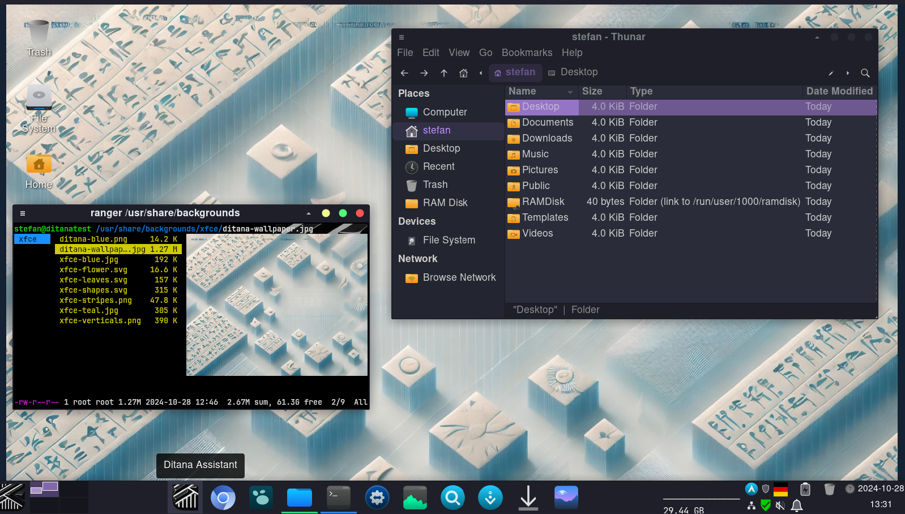

# ditana-config-xfce

This package is part of [Ditana GNU/Linux](https://ditana.org) and is installed when users select a desktop environment in the Ditana installer, providing configuration and customization for XFCE. The package manages system-wide settings and user-specific defaults to ensure an optimal experience with high-DPI displays, desktop panels, font configurations, and system behavior.

## Features

### Display Configuration and DPI Scaling

- **Dynamic Display Monitoring**: Enables the [xfce-display-config-observer](https://github.com/acrion/xfce-display-config-observer) systemd service to dynamically adjust XFCE’s font DPI and panel size based on the connected display's DPI. Whether you switch displays or change resolutions, XFCE adapts in real-time, ensuring consistent physical font and panel sizes.

- **XFCE Font DPI Scaling**: Fonts are automatically scaled to match the DPI of the display, providing crisp text on high-resolution monitors. The XFCE panel size is similarly adjusted, scaling proportionally to the DPI to maintain an appropriate physical size.

### Package Management

#### Kalu Upgrade Notifier

Ditana uses [Kalu](https://github.com/Thulinma/kalu) as the upgrade notifier. Kalu not only informs users about available system updates but also provides the latest [Arch Linux News](https://archlinux.org/news/) and allows the system to be upgraded with a double-click on the tray icon.

#### Arch-Audit-GTK Security Notifier

To enhance system security awareness, Ditana includes [arch-audit-gtk](https://github.com/kpcyrd/arch-audit-gtk), which displays a tray indicator when security updates are missing. This lightweight utility checks for known vulnerabilities in installed packages and alerts the user if any action is required.

#### PacUI: Effortless Package Management with Elegance

[PacUI](https://github.com/excalibur1234/pacui) is integrated into Ditana to offer a responsive and user-friendly terminal interface for package management. It ensures that the UI remains fully interactive without freezing during operations, allowing users to quickly scroll through packages, navigate descriptions, and initiate actions seamlessly.

The integration of the [fuzzy finder (fzf)](https://github.com/junegunn/fzf) enables instant search capabilities. Users can start typing and immediately narrow down results, providing a fluid and efficient way to locate packages, logs, patches, and more.


Despite being terminal-based, PacUI integrates smoothly into the desktop environment. An icon and a `.desktop` file allow it to be launched like any graphical application, combining the efficiency of a terminal interface with desktop accessibility. This blend of responsiveness, clear guidance, and seamless integration makes PacUI a robust tool for efficient package management on Arch-based systems.

A unique feature in PacUI’s menu is the "Edit Config Files" option, presenting a curated list of common Linux configuration files, including Arch-specific ones, for easy access and editing.

### Font Choices and Theming

Consistency and readability are key in Ditana's font and theme selections:

- **System Fonts**:

  - [Google Noto Fonts](https://fonts.google.com/noto) are set as the default system font due to their extensive Unicode coverage, including scripts like Cuneiform, aligning with Ditana's thematic inspiration.

  - [JetBrains Mono Nerd Font](https://github.com/ryanoasis/nerd-fonts/tree/master/patched-fonts/JetBrainsMono): Chosen as the monospace font system-wide for its readability, programming ligatures, and extensive glyph coverage. To ensure this font is used consistently across all applications, it is configured in multiple places because configuring it in just one place isn't sufficient:
    - Via XFCE’s `xsettings` configuration.
    - Via `gsettings` in the initialization script `xfce-first-login.sh`.

- **Theme Configuration**:

  - [Dracula Theme](https://draculatheme.com/gtk): To maintain a consistent look across all applications, the Dracula theme is enforced in three places, as configuring it in only one place isn't sufficient for all applications:
    - Via XFCE’s `xsettings` configuration.
    - Via `gsettings` in `xfce-first-login.sh`.
    - System-wide in `/etc/environment`.

- **Icon Theme**:

  - [Kora Yellow icon theme](https://www.gnome-look.org/p/1256209) is installed and configured to complement the overall aesthetic.

### Enhanced File Management with Thunar

The Thunar file manager is extended with useful context menu entries to streamline user workflows.


- **Open Terminal Here**: Quickly launch a terminal in the current directory.

- **Open Disk Management**: Access disk management tools directly. Ditana installs [gnome-disk-utility](https://github.com/GNOME/gnome-disk-utility) for this.

- **Copy Path to Clipboard**: Copy the file or directory path for easy sharing or scripting.

### Desktop Customization

- **Wallpaper Cheat Sheet Overlay**: The [xfce-wallpaper-overlay](https://github.com/acrion/xfce-wallpaper-overlay) is used to overlay a Ditana-specific cheat sheet on top of the user’s custom desktop background (which could be managed by a tool like Variety or simply a solid color). The cheat sheet, visible on the desktop, provides helpful system shortcuts and can be edited by users to suit their needs.

- **Docklike Taskbar**: The [XFCE docklike taskbar](https://gitlab.xfce.org/panel-plugins/xfce4-docklike-plugin) is installed and configured. On the first login, the system checks whether specific applications (such as common browsers) are installed and pins them to the taskbar.


Ditana Desktop immediately after installation, with no additional changes. Two applications are open: the File Manager and Ranger, displaying an image in the terminal. For this screenshot, the cheat sheet that is automatically [overlaid on the desktop background](https://github.com/acrion/xfce-wallpaper-overlay) has been removed.

- **Keyboard Shortcuts**: Custom shortcuts are configured for volume control, workspace navigation, and launching applications like [Catfish](https://bluesabre.org/projects/catfish/) and the system monitor. Ditana replaces the default [xfce4-taskmanager](https://docs.xfce.org/apps/xfce4-taskmanager/start) with the more feature-rich [gnome-system-monitor](https://apps.gnome.org/SystemMonitor/). This provides users with advanced system monitoring capabilities, including detailed process information, resource usage graphs, and system performance metrics.

- **Default Terminal Configuration**: To resolve issues with terminal emulator detection and execution in XFCE, Ditana includes [xdg-terminal-exec-git](https://github.com/Vladimir-csp/xdg-terminal-exec). XFCE and GLib lack a standardized method for determining the default terminal emulator, which can lead to problems with launching terminal applications. By configuring [kitty](https://sw.kovidgoyal.net/kitty/) as the default terminal in `/etc/xdg/xdg-terminals.list`, Ditana ensures that terminal applications launch correctly across the system.

- **Ranger Configuration**: Initializes and customizes the [ranger file manager](https://ranger.github.io/) to display images and enable other advanced features.

- **Wallpaper Setup**: Sets the default wallpaper to the customized Ditana background. Note that the default setting of Ditana GNU/Linux overrides the Ditana-specific wallpaper with a configured [Variety](https://peterlevi.com/variety/) wallpaper.

### Addressing NVIDIA Rendering Issues

For systems with NVIDIA graphics cards, Ditana disables the DMA-BUF renderer for WebKitGTK applications to address rendering problems. By setting the environment variable `WEBKIT_DISABLE_DMABUF_RENDERER=1`, it forces WebKit to use software rendering for stability.

```bash
# /etc/profile.d/ditana-disable-dmabuf-for-webkit.sh
export WEBKIT_DISABLE_DMABUF_RENDERER=1
```

### System Services

The package manages several systemd services to ensure optimal system functionality:

- **Display Manager**: Ensures the [lightdm](https://github.com/canonical/lightdm) display manager is enabled with [slick-greeter](https://github.com/linuxmint/slick-greeter) as the default greeter.

- **Firewall Protection**: Activates firewall protection by enabling [firewalld](https://firewalld.org/) during the installation.

- **Dynamic Display Adjustment**: Manages the [xfce-display-config-observer](https://github.com/acrion/xfce-display-config-observer) service for dynamic display settings.

### System Initialization

Upon the first login, an initialization script (`xfce-first-login.sh`) configures essential settings to ensure a smooth user experience. This script runs only once per user, ensuring that each user's environment is set up correctly without unnecessary repetition. Key configurations include:

- **GNOME Keyring Workaround**: Restarts the GNOME Keyring daemon to prevent [issues with keyring initialization on the first login](https://gitlab.gnome.org/GNOME/gnome-keyring/-/issues/116), ensuring applications like Chromium start properly.

- **Application and Theme Settings**: Applies configurations for fonts and themes using `gsettings` to enforce consistency across applications.

- **Docklike Taskbar Pinning**: Checks for the installation of specific applications and pins them to the taskbar for quick access.

## Git Hooks for Development

Developers working on this package should install custom git hooks by running the script located at `git-hooks/install-hooks.sh`. These hooks ensure that file permissions are correctly tracked, as git does not fully support Linux file permission handling.

## Documentation

For more detailed information about Ditana GNU/Linux and its design philosophy, please visit https://ditana.org/docs.
